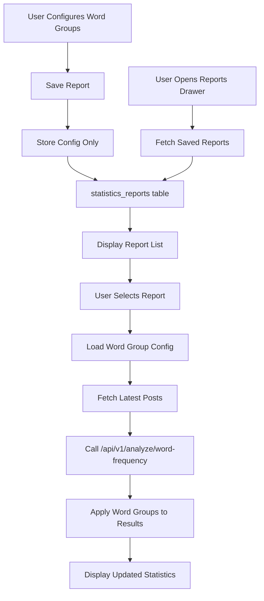

# Statistics Report System Implementation Plan

## 📊 Implementation Status: 90% Complete

### ✅ Completed Features
- Database schema and RLS policies
- TypeScript types and Zod schemas
- Data access layer with Supabase
- SWR hooks for data fetching
- Backend API integration
- UI components (SaveReportModal, ReportListDrawer)
- Statistics page integration

### 🔧 Remaining Tasks
- Testing with real data
- Error handling refinement
- Performance optimization

## Overview
Implement a persistent statistics report system that allows teachers to save word group configurations, generate reports at specific points in time, and compare statistics across different classes (journeys). The system leverages existing backend APIs to ensure real-time data accuracy.

## Core Requirements
1. **Persistent Word Group Storage**: Save custom word group configurations only
2. **Real-time Report Generation**: Apply saved configurations to latest data via backend APIs
3. **Report Management**: View, select, and apply saved reports with fresh data
4. **Cross-Journey Comparison**: Compare statistics across different classes
5. **Backend API Integration**: Utilize `/api/v1/analyze/word-frequency` and `/api/v1/analyze/group-words` for real-time analysis

## Database Schema

### New Tables

#### `statistics_reports`
```sql
CREATE TABLE statistics_reports (
  id UUID PRIMARY KEY DEFAULT uuid_generate_v4(),
  journey_id UUID REFERENCES journeys(id) ON DELETE CASCADE,
  created_by UUID REFERENCES profiles(id),
  name VARCHAR(255) NOT NULL,
  description TEXT,
  word_groups JSONB NOT NULL, -- Stores word group configurations
  metadata JSONB, -- Additional report metadata (filters, settings)
  created_at TIMESTAMPTZ DEFAULT NOW(),
  updated_at TIMESTAMPTZ DEFAULT NOW()
);

-- Indexes
CREATE INDEX idx_statistics_reports_journey_id ON statistics_reports(journey_id);
CREATE INDEX idx_statistics_reports_created_by ON statistics_reports(created_by);
```

#### Note on Data Storage
- **No frequency snapshots needed**: Backend APIs provide real-time analysis
- **Configuration only**: Store only word group settings, not frequency data
- **Fresh data guarantee**: Every report application fetches latest posts

### Word Groups JSON Structure
```json
{
  "groups": [
    {
      "id": "group-1",
      "name": "감정 표현",
      "color": "#FF6B6B",
      "words": ["행복", "슬픔", "기쁨", "분노"],
      "isVisible": true,
      "order": 0
    },
    {
      "id": "group-2",
      "name": "학습 관련",
      "color": "#4ECDC4",
      "words": ["공부", "시험", "과제", "학교"],
      "isVisible": true,
      "order": 1
    }
  ],
  "settings": {
    "minFrequency": 2,
    "showQuestionText": true,
    "excludedWords": []
  }
}
```

## Feature Components

### 1. Report Management UI
- **Location**: Within journey statistics page
- **Components**:
  - `ReportManager.tsx`: Main container for report operations
  - `SaveReportModal.tsx`: Modal for saving current configuration
  - `ReportListDrawer.tsx`: Chakra Drawer for viewing/selecting reports
  - `ReportCard.tsx`: Individual report display component

### 2. Core Functionality

#### Save Report Flow
1. User configures word groups in current statistics view
2. Click "Save Report" button
3. Modal opens with fields:
   - Report name (required)
   - Description (optional)
   - Include current filter settings (checkbox)
4. Save configuration to database (word groups only, not frequency data)
5. Show success notification

#### Load Report Flow
1. User clicks "View Reports" button
2. Drawer slides in from right showing saved reports
3. Each report card displays:
   - Report name and description
   - Creation date and author
   - Preview of word groups (color-coded badges)
   - "Apply" and "Delete" actions
4. Clicking "Apply":
   - Loads saved word group configuration
   - Fetches latest posts data from database
   - Calls `/api/v1/analyze/word-frequency` for current text analysis
   - Applies word groups using `/api/v1/analyze/group-words` if needed
   - Displays updated statistics with real-time data

### 3. API Integration Strategy

#### Backend API Utilization
- **`/api/v1/analyze/word-frequency`**: Analyze latest posts content
  - Called when applying saved report to get current frequency data
  - Ensures real-time accuracy without storing stale data
  
- **`/api/v1/analyze/group-words`**: Group words by similarity
  - Optional: Can be used to suggest word groupings
  - Helps maintain consistency across reports

#### Frontend API Endpoints

##### `/api/statistics/reports`
- `GET`: List reports for a journey
- `POST`: Create new report (saves word groups only)
- `PUT /:id`: Update existing report configuration
- `DELETE /:id`: Delete report

##### `/api/statistics/reports/:id/apply`
- `GET`: Get report configuration
- Triggers backend API calls for fresh data analysis
- Returns combined configuration + live data

### 4. Data Flow



## Implementation Steps

### Phase 1: Database Setup (Day 1) ✅
1. ✅ Create database tables via Supabase migration
2. ✅ Set up RLS policies for reports
3. ✅ Generate TypeScript types (manually updated)
4. ✅ Removed `statistics_report_snapshots` table (not needed with API approach)

### Phase 2: Backend Integration (Day 2) ✅
1. ✅ Create data access functions in `/src/utils/data/statistics-reports.ts`
2. ✅ Implement SWR hooks in `/src/hooks/useStatisticsReports.ts`
3. ✅ Add API client functions for backend services in `/src/utils/api/statistics-analysis.ts`:
   - Word frequency analysis wrapper
   - Group words wrapper with caching
   - Combined `applyReportToLatestData` function
4. ✅ Add Zod schemas for validation in `/src/types/statistics-report.ts`

### Phase 3: UI Components (Day 3-4) ✅
1. ✅ Create SaveReportModal component
2. ✅ Implement ReportListDrawer with Chakra UI
3. ✅ Add report management buttons to existing statistics page
4. ✅ Integrate with existing WordGroupDisplay component
5. ✅ Add loading states for API calls

### Phase 4: API Integration & Testing (Day 5)
1. Connect frontend with backend analysis APIs
2. Implement caching strategy for API responses
3. Test real-time data updates with saved configurations
4. Verify cross-journey report sharing
5. Add error handling for API failures

### Phase 5: Enhancement (Day 6)
1. Add report sharing functionality
2. Implement report templates for common word groups
3. Add export functionality (CSV/PDF)
4. Create comparison view for multiple reports
5. Optimize API call batching for performance

## Technical Considerations

### State Management
- Use Zustand for local report selection state
- SWR for data fetching and caching
- Maintain compatibility with existing word frequency hooks
- Cache backend API responses with appropriate TTL

### Performance
- Lazy load report drawer content
- Cache report configurations locally
- Leverage backend API caching (Redis/Supabase)
- Batch API calls when possible
- Use `/api/v1/analyze/range-word-frequency` for journey-level analysis

### Security
- RLS policies to ensure users can only access reports from their journeys
- Validate user permissions for report creation/deletion
- Sanitize word group inputs
- Backend API authentication via JWT tokens

## UI/UX Design

### Report Drawer Layout
```
┌─────────────────────────────────┐
│  📊 저장된 통계 보고서           │
├─────────────────────────────────┤
│ ┌─────────────────────────────┐ │
│ │ 📝 중간고사 분석            │ │
│ │ 2024.03.15 | 김선생님       │ │
│ │ 🔴 감정 🟢 학습 🔵 일상    │ │
│ │ [적용] [수정] [삭제]        │ │
│ └─────────────────────────────┘ │
│ ┌─────────────────────────────┐ │
│ │ 📝 1학기 종합 보고서        │ │
│ │ 2024.03.10 | 김선생님       │ │
│ │ 🟡 핵심어휘 🟣 문법        │ │
│ │ [적용] [수정] [삭제]        │ │
│ └─────────────────────────────┘ │
│                                 │
│ [+ 새 보고서 만들기]            │
└─────────────────────────────────┘
```

### Save Report Modal
```
┌─────────────────────────────────┐
│  💾 통계 보고서 저장             │
├─────────────────────────────────┤
│ 보고서 이름 *                   │
│ ┌─────────────────────────────┐ │
│ │ 2024년 1학기 중간 분석      │ │
│ └─────────────────────────────┘ │
│                                 │
│ 설명 (선택사항)                 │
│ ┌─────────────────────────────┐ │
│ │ 중간고사 이후 학생들의      │ │
│ │ 주요 관심사 분석...         │ │
│ └─────────────────────────────┘ │
│                                 │
│ ☑ 현재 필터 설정 포함           │
│ ☑ 최소 단어 횟수 설정 포함     │
│                                 │
│ [취소]            [저장]        │
└─────────────────────────────────┘
```

## Success Metrics
1. **Adoption Rate**: % of teachers using saved reports feature
2. **Report Creation**: Average reports created per journey
3. **Comparison Usage**: Frequency of cross-journey comparisons
4. **Time Saved**: Reduction in time to analyze statistics
5. **User Satisfaction**: Feedback on report functionality

## Future Enhancements
1. **Automated Reports**: Schedule periodic report generation
2. **Report Templates**: Pre-configured word groups for common analyses
3. **Collaborative Reports**: Share reports across teachers
4. **AI Insights**: Automatic word group suggestions based on content
5. **Historical Trends**: Track word frequency changes over time
6. **Export Options**: Generate PDF reports for parents/administration

## Migration Strategy
1. No breaking changes to existing statistics components
2. Progressive enhancement approach
3. Backward compatibility with current word group system
4. Optional adoption by teachers

## Testing Checklist
- [ ] Report CRUD operations
- [ ] Word group persistence
- [ ] Real-time data updates
- [ ] Cross-journey report access
- [ ] Permission validation
- [ ] UI responsiveness
- [ ] Error handling
- [ ] Loading states
- [ ] Empty states
- [ ] Data integrity